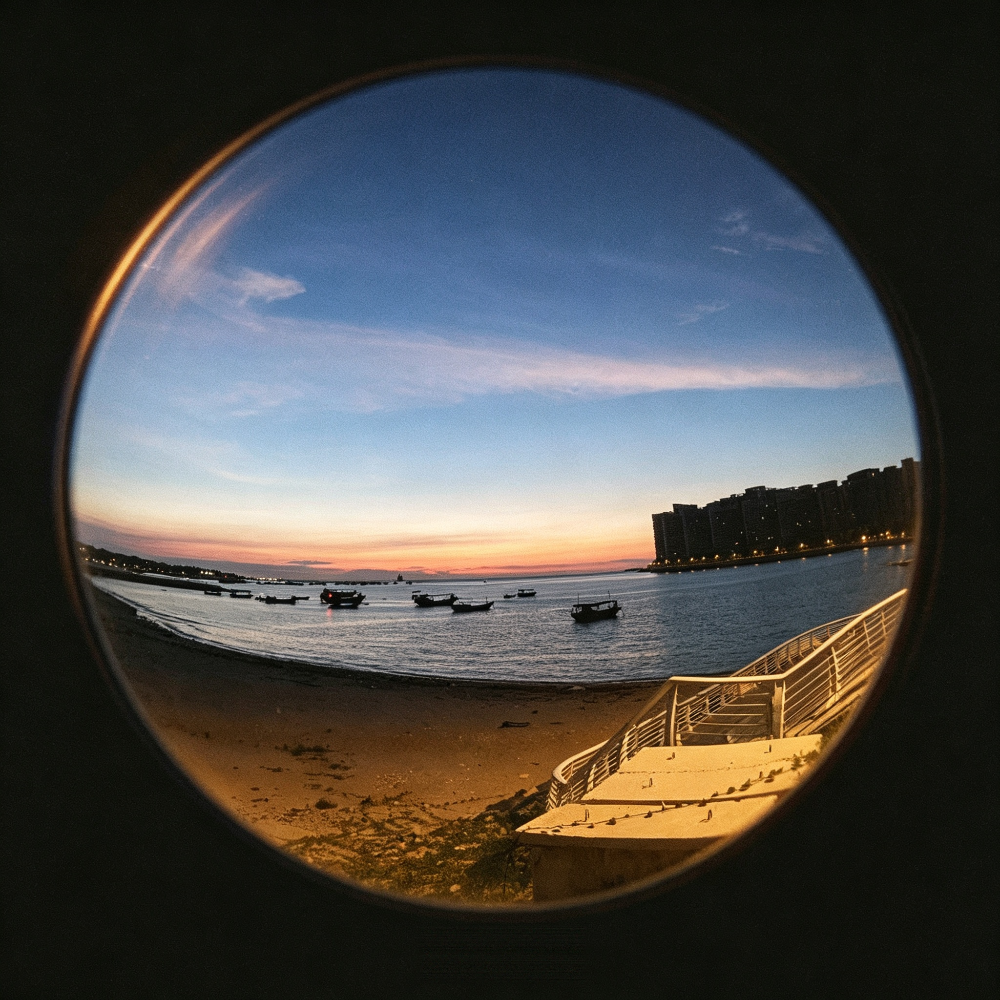

# 鱼眼复古 · Fisheye Retro Skill

一个 OpenAI Codex Skill，将任意照片转化为**圆形鱼眼镜头 + 复古胶片**风格。


## 风格特征

- **圆形鱼眼画面**：180° 桶形畸变，圆形裁切，暗角自然衰减
- **复古胶片质感**：有机颗粒、色偏（暖黄/青绿/淡紫）、光晕、柔焦
- **Lo-fi 街头氛围**：随性、粗糙、非精致、Analog 感
- **暗色画框**：圆形外沉入纯黑/深炭色底
- **默认无文字**：默认不生成任何文字、水印或标注，只有你指定文字时才会出现

## 安装

1. 确保你已安装 [OpenAI Codex](https://github.com/openai/codex)
2. 克隆本仓库：
   ```bash
   git clone https://github.com/Roc8458/fisheye-retro-v1.git
   ```
3. 复制 skill 到 Codex skills 目录：
   ```bash
   cp -R fisheye-retro-v1/skills/fisheye-retro-v1 ~/.codex/skills/
   ```
4. 重启 Codex

## 使用

上传照片，然后输入：

```
$fisheye-retro-v1
```

或描述你的需求：

```
帮我把这张照片做成鱼眼复古胶片风格
```

## 效果预览

### 示例 01 · 海滨黄昏

| 原图 | 鱼眼复古效果 |
|------|------|
|  |  |

## 技术说明

本 Skill 基于纯提示词工程（Prompt Engineering），零代码。核心逻辑写在 `SKILL.md` 中，Codex 读取后自动调用内置图像生成模型完成风格化。

## License

MIT
